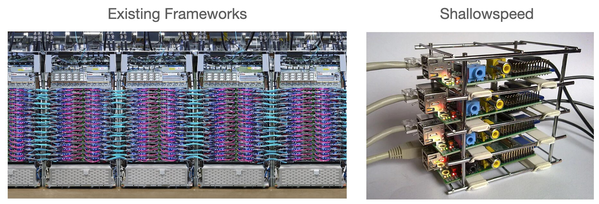

# Shallowspeed

A tiny implementation of distributed training for sequential deep learning models.
Implemented using plain Numpy & mpi4py.



## Setup
```bash
conda env create
pip install -e .
# M1 Macs: conda install "libblas=*=*accelerate"
python download_dataset.py
```

## Usage
```bash
# Sequential training
python train.py
# Data parallel distributed training
mpirun -n 4 python train.py --dp 4
# Pipeline parallel distributed training
mpirun -n 4 python train.py --pp 4 --schedule naive
# Data & pipeline parallel distributed training
mpirun -n 8 python train.py --dp 2 --pp 4 --schedule pipedream
```
